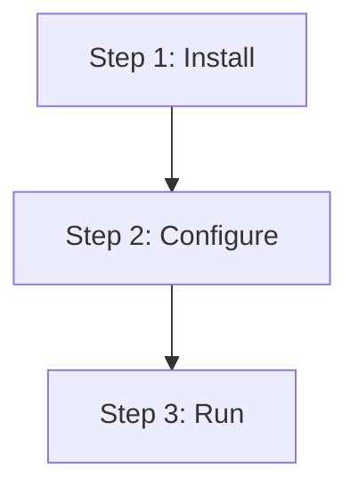

# Bridge Visual — Reader-Aware Augmentation (v0.54)

The bridge visual layer **automatically adds Mermaid flowcharts and
collapsible outlines** to KB markdown articles when they're judged
"human-readable" (showcase / system / how-to with steps) rather than
"AI-readable" (raw data dump / dense reference).

> **Why this exists** (user goal verbatim):
> "通过用户的文章，根据人类阅读的可能性需要（人类阅读多于AI读取，或偏展示型/
> 系统型的内容）在收入库的同时也为文章内容增加流程图、大纲视图的能力"

## Quick Start

### Install

```bash
cd ~/knowledge_SQL && source .venv/bin/activate
pip install -e ./packages/bridge-visual
```

### Enable in bridge ingest

```bash
# In your KBSQL .env:
BRIDGE_VISUAL_ENABLED=true

# Optional: skip the in-place write-back (useful for testing)
BRIDGE_VISUAL_DRYRUN=false  # default
```

When `BRIDGE_VISUAL_ENABLED=true`, every file processed by `bridge_ingest`
is profiled. Files scoring `audience_score >= 0.6` get a Mermaid + outline
block injected directly into their markdown source (auto-commit + optional
auto-push).

The injection is wrapped in marker comments:

```markdown
<!-- bridge-visual:start v=1 audience=0.78 -->

> 🤖 Auto-generated visual aids by KBSQL bridge.



<details>
<summary>📖 Outline</summary>

- [Setup Guide](#setup-guide)
  - [Prerequisites](#prerequisites)
  - [Step 1: Install](#step-1-install)
  ...

</details>

<!-- bridge-visual:end -->

# Setup Guide
[original content unchanged below]
```

The augmenter is **idempotent**: re-running on an already-augmented file
replaces the existing block (doesn't duplicate). When a file's audience
score later drops below the threshold (e.g. you removed the steps), the
stale block gets stripped on the next augment.

## Reader Profiler

`profile_reader(markdown)` returns:

| Field | Type | Description |
|-------|------|-------------|
| `audience_score`     | float (0-1) | 0=AI-only, 1=human showcase |
| `has_steps`          | bool | Found `## Step N` or `## 第N步` |
| `has_branches`       | bool | Decision/conditional language |
| `has_state_machine`  | bool | State + transition vocabulary |
| `has_outline_value`  | bool | ≥ 1500 chars |
| `heading_count`      | int | H2 + H3 count |
| `char_count`         | int | Body length |
| `rationale`          | dict | Per-signal contribution to score |

### Scoring weights (v0.54)

| Signal | Weight | Trigger |
|--------|--------|---------|
| frontmatter type | 0.20 | howto > analysis > concept > summary > entity |
| H2 step structure | 0.20 | "## Step N" / "## 第N步" |
| Decision language | 0.15 | if/then/else, 决策 |
| State machine | 0.10 | state diagram / 状态机 |
| Length (>3000) | 0.15 | long doc benefits from outline |
| TOC potential (≥5 H2/H3) | 0.10 | many headings |
| Visual cues | 0.10 | "see figure", existing mermaid |

Cap at 1.0. Default threshold for augmentation: `0.6`.

## Mermaid Generator

Picks the best diagram type:

1. **State diagram** if `has_state_machine` AND ≥2 transitions detected
   → `stateDiagram-v2 [*] --> X X --> Y Y --> Z`
2. **Flowchart TD** if `has_steps` AND ≥2 steps
   → `flowchart TD n0 --> n1 --> n2`
3. **None** otherwise (no fabrication — better to omit than guess)

## Outline Generator

Builds `<details>` collapsible TOC from H1/H2/H3 headings, GitHub-style
anchor slugs (CJK supported). Skipped if fewer than 3 headings.

## Python API

```python
from bridge_visual import (
    augment_markdown,       # full pipeline
    profile_reader,         # just score, no augment
    generate_mermaid,       # just diagram
    generate_outline,       # just TOC
)

text = open("wiki/howtos/setup.md").read()

# Just inspect
profile = profile_reader(text)
print(f"audience: {profile.audience_score}")
print(f"rationale: {profile.rationale}")

# Augment with default threshold (0.6)
result = augment_markdown(text)
if result.augmented:
    open("wiki/howtos/setup.md", "w").write(result.output)
else:
    print(f"skipped: {result.skipped_reason}")

# Custom threshold
result = augment_markdown(text, threshold=0.4)
```

## REST API

| Method | Path | Purpose |
|--------|------|---------|
| POST | `/v1/bridge/visual/profile` | Reader score (no augmentation) |
| POST | `/v1/bridge/visual/augment` | Inject mermaid + outline |

```bash
curl -X POST http://localhost:8080/v1/bridge/visual/augment \
  -H "Content-Type: application/json" \
  -H "X-Requested-With: XMLHttpRequest" \
  -d '{
    "markdown": "---\ntype: howto\n---\n# Setup\n## Step 1: ...\n## Step 2: ...",
    "threshold": 0.6
  }'
```

## MCP Tools

For Claude Code/Desktop:

| Tool | Description |
|------|-------------|
| `kb_visual_profile`  | Score readability, no augment |
| `kb_visual_augment`  | Inject mermaid + outline |

## In-Place Write-Back Safety Contract

When the bridge_ingest pipeline runs visual augmentation, it calls
`bridge.writers.kb_writer.augment_existing_in_place()`. This is the
**only** function permitted to modify pre-existing KB files outside
`wiki/summaries/` and `wiki/analyses/`. Its safety contract:

1. Target MUST already exist (no new files via this path)
2. Target MUST be a `.md` file
3. Augmented text MUST contain bridge-visual marker comments (proves it
   came from the augmenter, not arbitrary input)
4. Path-traversal guard: target must be inside `HOGWARTS_KB_PATH`
5. Auto-commit with `kbsql-bridge[bot]` author + optional push

To disable in-place write-back temporarily (e.g. testing):

```bash
BRIDGE_VISUAL_DRYRUN=true
```

In dry-run mode, augmentation is computed but never written. Useful for
seeing what *would* be added without modifying files.

## Obsidian Rendering

Default Obsidian + obsidian-git renders Mermaid blocks natively (no plugin
needed). The `<details>` outline renders as a collapsible widget in
preview mode. Both also render correctly on GitHub when you push.

## v0.55 Roadmap

- Decision-tree flowchart (when `has_branches=True`) — currently silent skip
- Sankey / sequence diagram for time-series content
- Per-section thumbnails (auto-generated from H2 sections)
- Optional GLM-4 polish for diagram labels (`BRIDGE_VISUAL_LLM_POLISH=true`)
- Per-file opt-out via frontmatter (`bridge_visual: skip`)
